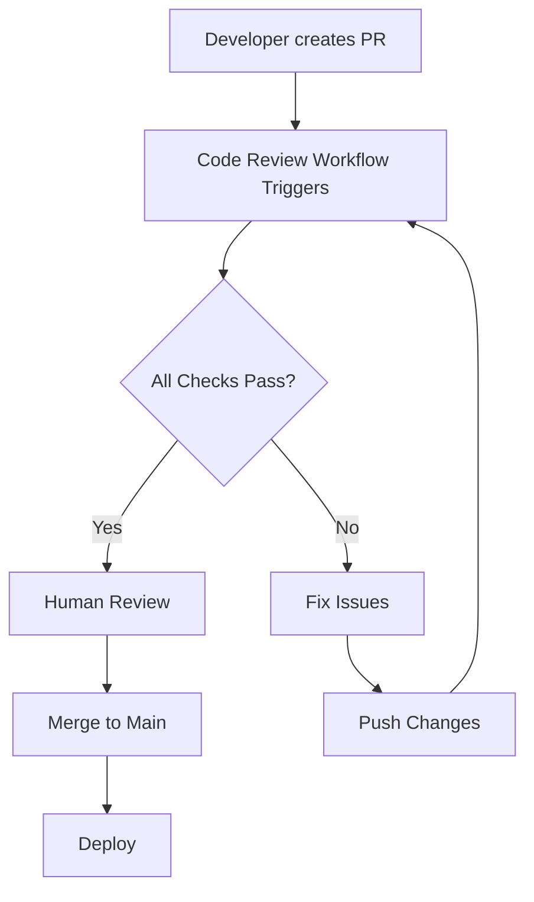

# Automated Code Review Setup

## Overview

This project now includes a comprehensive automated code review system powered by GitHub Actions. The workflow runs on every pull request and push to main/develop branches.

## Code Review Agent Components

### 1. **ESLint Review** (Static Analysis)
- Runs ESLint on both backend and frontend code
- Provides inline comments on code style issues
- Uses reviewdog for GitHub PR integration

### 2. **TypeScript Type Checking**
- Validates TypeScript types across the codebase
- Catches type errors before they reach production
- Runs without emitting files (--noEmit)

### 3. **AI-Powered Code Review** (Optional)
- Uses OpenAI GPT-4 for intelligent code review
- Provides suggestions for:
  - Code quality improvements
  - Best practices
  - Potential bugs
  - Performance optimizations
- Requires `OPENAI_API_KEY` secret to be configured

### 4. **Security Review**
- **Trivy Scanner**: Detects vulnerabilities in dependencies
- **OWASP Dependency Check**: Identifies known security issues
- Results uploaded to GitHub Security tab

### 5. **Code Complexity Analysis**
- Measures code complexity metrics
- Helps identify overly complex functions
- Provides quality gate feedback

## Workflow Jobs

```yaml
┌─────────────────────────────────────────┐
│         code-review (Main Job)          │
│  - ESLint Backend                       │
│  - TypeScript Check Backend             │
│  - ESLint Frontend                      │
│  - TypeScript Check Frontend            │
│  - Reviewdog Integration                │
└─────────────────────────────────────────┘
                  ↓
┌─────────────────────────────────────────┐
│      ai-code-review (PR Only)           │
│  - AI-powered review with GPT-4         │
│  - Inline PR comments                   │
└─────────────────────────────────────────┘
                  ↓
┌─────────────────────────────────────────┐
│      security-review                    │
│  - Trivy vulnerability scan             │
│  - OWASP dependency check               │
└─────────────────────────────────────────┘
                  ↓
┌─────────────────────────────────────────┐
│      quality-gates                      │
│  - Code complexity check                │
│  - Generate review summary              │
└─────────────────────────────────────────┘
```

## Setup Instructions

### 1. Required GitHub Secrets

Add these secrets in your GitHub repository settings:

```bash
Settings → Secrets and variables → Actions → New repository secret
```

**Required:**
- `GITHUB_TOKEN` - Automatically provided by GitHub Actions

**Optional (for AI review):**
- `OPENAI_API_KEY` - Your OpenAI API key for AI-powered reviews

### 2. Enable Permissions

The workflow requires these permissions (already configured in the workflow file):
- `contents: read` - Read repository contents
- `pull-requests: write` - Comment on PRs
- `checks: write` - Create check runs
- `issues: write` - Update issue comments

### 3. Install ESLint (if not already present)

**Backend:**
```bash
cd backend
npm install --save-dev eslint @typescript-eslint/parser @typescript-eslint/eslint-plugin
npx eslint --init
```

**Frontend:**
```bash
cd frontend
npm install --save-dev eslint @typescript-eslint/parser @typescript-eslint/eslint-plugin eslint-plugin-react
npx eslint --init
```

### 4. Add NPM Scripts

Add to `package.json` in both backend and frontend:

```json
{
  "scripts": {
    "lint": "eslint . --ext .ts,.tsx",
    "lint:fix": "eslint . --ext .ts,.tsx --fix",
    "type-check": "tsc --noEmit"
  }
}
```

## Usage

### Automatic Triggers

The code review workflow runs automatically on:

1. **Pull Requests** - When opened, synchronized, or reopened
2. **Push to main/develop** - On direct commits

### Manual Trigger

You can also trigger the workflow manually:

1. Go to Actions tab in GitHub
2. Select "Code Review & CI"
3. Click "Run workflow"

### Reviewing Results

#### In Pull Requests:
- **Inline Comments**: ESLint and AI reviews appear as PR comments
- **Checks Tab**: See all check results and logs
- **Files Changed**: Review suggestions inline with code

#### In Actions Tab:
- **Summary**: View overall workflow status
- **Job Logs**: Detailed execution logs for each job
- **Artifacts**: Download complexity reports if needed

## Customization

### Adjust Review Strictness

Edit `.github/workflows/code-review.yml`:

```yaml
# Change from 'warning' to 'error' for stricter reviews
reviewdog -level=error  # instead of -level=warning
```

### Exclude Files from AI Review

```yaml
exclude: "*.md,*.json,*.yml,*.yaml,package-lock.json,dist/**"
```

### Change AI Model

```yaml
OPENAI_API_MODEL: "gpt-3.5-turbo"  # Faster, cheaper
# or
OPENAI_API_MODEL: "gpt-4-turbo"    # More thorough
```

### Add Custom Review Rules

Create `.github/reviewdog.yml`:

```yaml
runner:
  eslint:
    cmd: npx eslint --format=checkstyle
    errorformat:
      - "%f:%l:%c: %m"
    level: warning
```

## Best Practices

1. **Fix Issues Early**: Address review comments before requesting human review
2. **Run Locally First**: Use `npm run lint` and `npm run type-check` before pushing
3. **Security First**: Never ignore security vulnerabilities
4. **Keep Complexity Low**: Refactor complex functions flagged by the analyzer

## Troubleshooting

### Issue: "No lint script found"

Add lint script to package.json:
```json
"lint": "eslint . --ext .ts,.tsx"
```

### Issue: "TypeScript errors found"

Run locally to fix:
```bash
npx tsc --noEmit
```

### Issue: "AI review not running"

Check:
1. `OPENAI_API_KEY` secret is set
2. Pull request is from same repository (not a fork)
3. Workflow has required permissions

### Issue: "Reviewdog comments not appearing"

Verify:
1. `GITHUB_TOKEN` has `pull-requests: write` permission
2. ESLint is outputting checkstyle format
3. PR is not from a fork (security restriction)

## Cost Considerations

### AI Review Costs
- GPT-4: ~$0.01 - $0.10 per review (depending on diff size)
- GPT-3.5-turbo: ~$0.001 - $0.01 per review

**Cost Savings Tips:**
1. Use GPT-3.5-turbo for smaller PRs
2. Exclude documentation files
3. Set up usage limits in OpenAI dashboard
4. Only run AI review on specific PR labels

## Integration with Development Workflow



## Roadmap

Future enhancements planned:
- [ ] Add unit test coverage reporting
- [ ] Integration with SonarQube
- [ ] Custom AI prompts for domain-specific reviews
- [ ] Performance benchmarking
- [ ] Auto-fix suggestions via PR commits

## Resources

- [Reviewdog Documentation](https://github.com/reviewdog/reviewdog)
- [GitHub Actions Documentation](https://docs.github.com/en/actions)
- [ESLint Rules](https://eslint.org/docs/rules/)
- [TypeScript Handbook](https://www.typescriptlang.org/docs/handbook/intro.html)
- [OWASP Dependency Check](https://owasp.org/www-project-dependency-check/)
